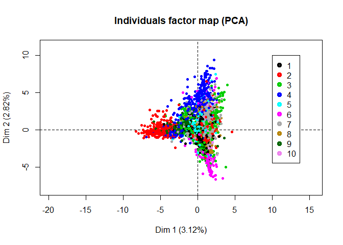
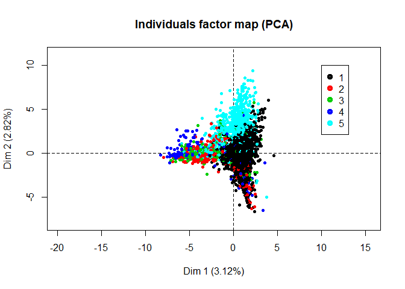

Board Game
================
Jui-Ying Hsieh, Li-Hsin Chen

1. Background
-------------

2. Problem Statement
--------------------

3. Method
---------

#### 3.1 Expand Mechanic and Category Variables

Variables Mechanic and Category

``` r
colnames(boardgame_cluster)[1:20]
```

    ##  [1] "Action / Movement Programming" "Co-operative Play"            
    ##  [3] "Grid Movement"                 "Hand Management"              
    ##  [5] "Modular Board"                 "Role Playing"                 
    ##  [7] "Simultaneous Action Selection" "Storytelling"                 
    ##  [9] "Variable Player Powers"        "Action Point Allowance System"
    ## [11] "Point to Point Movement"       "Set Collection"               
    ## [13] "Trading"                       "Auction/Bidding"              
    ## [15] "Card Drafting"                 "Area Control / Area Influence"
    ## [17] "Campaign / Battle Card Driven" "Dice Rolling"                 
    ## [19] "Tile Placement"                "Area Movement"

``` r
head(boardgame_cluster[,1:5])
```

    ##   Action / Movement Programming Co-operative Play Grid Movement
    ## 1                             1                 1             1
    ## 2                             0                 1             0
    ## 3                             0                 0             0
    ## 4                             0                 0             0
    ## 5                             0                 0             0
    ## 6                             0                 0             0
    ##   Hand Management Modular Board
    ## 1               1             1
    ## 2               1             0
    ## 3               0             0
    ## 4               1             0
    ## 5               1             0
    ## 6               1             0

``` r
#=========================================================================
# Clustering (K-means) determined by max mode
#=========================================================================
n_cluster <- 10
getmode <- function(v) {
  uniqv <- unique(v)
  uniqv[which.max(tabulate(match(v, uniqv)))]
}

cluster_max <- function(dat,n_cluster,num_iter){
  result <- matrix(0,nrow = dim(dat)[1],ncol = num_iter)
  for(i in 1:num_iter){
    result[,i] <- kmeans(dat,centers = n_cluster)$cluster
  }
  return(apply(result,MARGIN = 1,getmode))
}
#========================================================
#========================================================
cluster_result <- cluster_max(boardgame_cluster,n_cluster = n_cluster,num_iter = 100)


#========================================================
# Visualize clusters
#========================================================
# Visualize through PCA
library(MASS)
```

    ## 
    ## Attaching package: 'MASS'

    ## The following object is masked from 'package:dplyr':
    ## 
    ##     select

``` r
library(FactoMineR)
bgg_pca <- PCA(scale(boardgame_cluster),ncp = 6,graph = FALSE)
#plot(bgg_pca,choix = "var")
#plot(bgg_pca$ind$coord)
#legend(20,20,1:n_cluster,col = 1:n_cluster,pch = 1,pt.lwd = 4)

plot(bgg_pca,axes = c(1,2),habillage = "ind",col.hab = cluster_result,label = "none")
legend(10,10,1:n_cluster,col = 1:n_cluster,pch = 1,pt.lwd = 4)
```



``` r
boardgame_cluster_all <- cbind(names = boardgame$names,boardgame_cluster,cluster = cluster_result)
boardgame_cluster_all %>% group_by(cluster) %>% summarise(n=n())
```

    ## # A tibble: 10 x 2
    ##    cluster     n
    ##      <dbl> <int>
    ##  1       1   605
    ##  2       2  1275
    ##  3       3   210
    ##  4       4   358
    ##  5       5   227
    ##  6       6   351
    ##  7       7   582
    ##  8       8   537
    ##  9       9   302
    ## 10      10   552

``` r
#=========================================================================
# Word Cloud and Frequency Plot
#=========================================================================
word_freq <- c()
for(i in 1:n_cluster){
  word_freq <- cbind(word_freq,apply(boardgame_cluster_all[boardgame_cluster_all$cluster==i,-c(1,138)],2,sum))
}

i = 5
d <- data.frame(word=names(sort(word_freq[,i],decreasing = T)),freq = sort(word_freq[,i],decreasing = T))[1:10,]
```

``` r
ggplot(data = d,aes(x = reorder(word,-freq),y = freq)) + 
  geom_bar(stat = "identity", fill = "steelblue") +
  xlab("Game Type")+ ylab("Frequency") +
  ggtitle(paste("Top 10 Game Types of Cluster ",i))+
  theme_classic() +
  theme(
    axis.text.x = element_text(angle = 45, hjust = 1),
    plot.title = element_text(size=24, face="bold.italic",hjust = 0.5),
    axis.title.x = element_text(size=14, face="bold"),
    axis.title.y = element_text(size=14, face="bold")
  )
```



4. Result
---------

5. Future Work
--------------
