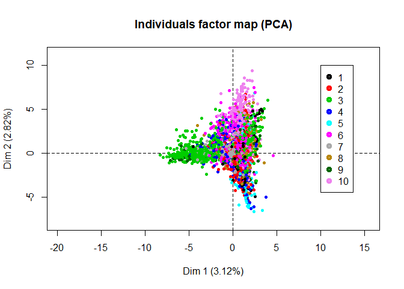
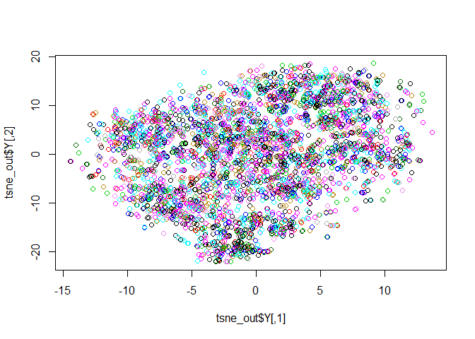

Board Game
================
Jui-Ying Hsieh, Li-Hsin Chen

### 1. Background

We enjoying playing baord games. We have collected more than 20 types of board games, and the number is still growing. We like to explore games, but play one new games after another blindly is not smart. There are evidence shown that more and more games are being created; 1600 games released in the last five years, while only 1086 games released in the 19th century. To explore games efficiently, we frequently visit the famous board game website BoardGameGeek (BGG). There is a comprehensive list of games including their rankings. Our approach to explore games is to review their rankings. We did actually find enjoyable games such as Agricola, Peurto Rico and Pandemic.

However, as we collect more and more games, we find out that rankings does not making us to find enjoyable games. It is obvious that most of the top ranking games strategy games. Other type of games typically are not able to go to top ranking because BGG's users prefer "heavier" games. For example, one of our favorite board games "cat in the sack" is ranked 1111 in BGG, which we think the game is way underestimate.

Hence, we grabbed the data from BGG, and tried to build a board game reference system that help players find their favorite games. This project is about designing a board game reference system, Board Game Match, that find the most enjoyable games for users. We hope Board Game Match can save players time and effort for exploring new games.

### 2. Method

Several fantastic algorithms have been invented and widely used in building a recommendation system in the past few years. The choice of algorithms highly depepends on the data used for the system. Based on the data we have, we choose [item-based collaborative filtering](https://en.wikipedia.org/wiki/Item-item_collaborative_filtering) method. In this method, recommendation is made by the similarity of items among each others, that is, how similar they are according to their features.

Dataset is obtained from [Kaggle](https://www.kaggle.com/mrpantherson/board-game-data#bgg_db_2018_01.csv). This dataset contains many interesting features of about 5,000 boardgames. These feature includes:

``` r
colnames(boardgame)
```

    ##  [1] "rank"        "bgg_url"     "game_id"     "names"       "min_players"
    ##  [6] "max_players" "avg_time"    "min_time"    "max_time"    "year"       
    ## [11] "avg_rating"  "geek_rating" "num_votes"   "image_url"   "age"        
    ## [16] "mechanic"    "owned"       "category"    "designer"    "weight"

#### 2.1 Expand Mechanic and Category Variables

Before using item-based collaborative filtering, we need to define the similarity between boardgames. We use only "mechanic" and "category" in the definition of similarity. There are 52 different mechanic types and 84 different categories. Hence, 136 (52 + 84) dummy variables are created to represent mechanic and category variables.

``` r
All_mechanic = unlist(strsplit(boardgame$mechanic, ", "))
Uniq_mechanic = unique(All_mechanic)
All_cat = unlist(strsplit(boardgame$category, ", "))
Uniq_cat = unique(All_cat)

boardgame_cluster <- matrix(0,nrow = dim(boardgame)[1],ncol = length(Uniq_mechanic)+length(Uniq_cat))

for(i in 1:length(Uniq_mechanic)){
  boardgame_cluster[,i] <- grepl(Uniq_mechanic[i],boardgame$mechanic)*1
}
for(i in 1:length(Uniq_cat)){
  boardgame_cluster[,length(Uniq_mechanic)+i] <- grepl(Uniq_cat[i],boardgame$category)*1
}
boardgame_cluster <- as.data.frame(boardgame_cluster)
colnames(boardgame_cluster)[1:length(Uniq_mechanic)] <- Uniq_mechanic
colnames(boardgame_cluster)[(1+length(Uniq_mechanic)):136] <- Uniq_cat
colnames(boardgame_cluster)[50] <- "none_mechanic"
colnames(boardgame_cluster)[114] <- "none_cat"
colnames(boardgame_cluster)[26] <- "Memory_mechanic"
colnames(boardgame_cluster)[117] <- "Memory_cat"
```

``` r
colnames(boardgame_cluster)[1:20]
```

    ##  [1] "Action / Movement Programming" "Co-operative Play"            
    ##  [3] "Grid Movement"                 "Hand Management"              
    ##  [5] "Modular Board"                 "Role Playing"                 
    ##  [7] "Simultaneous Action Selection" "Storytelling"                 
    ##  [9] "Variable Player Powers"        "Action Point Allowance System"
    ## [11] "Point to Point Movement"       "Set Collection"               
    ## [13] "Trading"                       "Auction/Bidding"              
    ## [15] "Card Drafting"                 "Area Control / Area Influence"
    ## [17] "Campaign / Battle Card Driven" "Dice Rolling"                 
    ## [19] "Tile Placement"                "Area Movement"

``` r
head(boardgame_cluster[,1:5])
```

    ##   Action / Movement Programming Co-operative Play Grid Movement
    ## 1                             1                 1             1
    ## 2                             0                 1             0
    ## 3                             0                 0             0
    ## 4                             0                 0             0
    ## 5                             0                 0             0
    ## 6                             0                 0             0
    ##   Hand Management Modular Board
    ## 1               1             1
    ## 2               1             0
    ## 3               0             0
    ## 4               1             0
    ## 5               1             0
    ## 6               1             0

``` r
#=========================================================================
# Clustering (K-means) determined by max mode
#=========================================================================
n_cluster <- 10
getmode <- function(v) {
  uniqv <- unique(v)
  uniqv[which.max(tabulate(match(v, uniqv)))]
}

cluster_max <- function(dat,n_cluster,num_iter){
  result <- matrix(0,nrow = dim(dat)[1],ncol = num_iter)
  for(i in 1:num_iter){
    result[,i] <- kmeans(dat,centers = n_cluster)$cluster
  }
  return(apply(result,MARGIN = 1,getmode))
}
#========================================================
#========================================================
cluster_result <- cluster_max(boardgame_cluster,n_cluster = n_cluster,num_iter = 100)


#========================================================
# Visualize clusters
#========================================================
# Visualize through PCA
library(MASS)
```

    ## 
    ## Attaching package: 'MASS'

    ## The following object is masked from 'package:dplyr':
    ## 
    ##     select

``` r
library(FactoMineR)
bgg_pca <- PCA(scale(boardgame_cluster),ncp = 6,graph = FALSE)
#plot(bgg_pca,choix = "var")
#plot(bgg_pca$ind$coord)
#legend(20,20,1:n_cluster,col = 1:n_cluster,pch = 1,pt.lwd = 4)

plot(bgg_pca,axes = c(1,2),habillage = "ind",col.hab = cluster_result,label = "none")
legend(10,10,1:n_cluster,col = 1:n_cluster,pch = 1,pt.lwd = 4)
```



``` r
boardgame_cluster_all <- cbind(names = boardgame$names,boardgame_cluster,cluster = cluster_result)
boardgame_cluster_all %>% group_by(cluster) %>% summarise(n=n())
```

    ## # A tibble: 10 x 2
    ##    cluster     n
    ##      <dbl> <int>
    ##  1       1   944
    ##  2       2  1066
    ##  3       3   831
    ##  4       4   502
    ##  5       5   498
    ##  6       6   278
    ##  7       7   120
    ##  8       8   240
    ##  9       9   347
    ## 10      10   173

``` r
#=========================================================================
# Word Cloud and Frequency Plot
#=========================================================================
word_freq <- c()
for(i in 1:n_cluster){
  word_freq <- cbind(word_freq,apply(boardgame_cluster_all[boardgame_cluster_all$cluster==i,-c(1,138)],2,sum))
}

i = 5
d <- data.frame(word=names(sort(word_freq[,i],decreasing = T)),freq = sort(word_freq[,i],decreasing = T))
```

``` r
ggplot(data = d[1:10,],aes(x = reorder(word,-freq),y = freq)) + 
  geom_bar(stat = "identity", fill = "steelblue") +
  xlab("Game Type")+ ylab("Frequency") +
  ggtitle(paste("Top 10 Game Types of Cluster ",i))+
  theme_classic() +
  theme(
    axis.text.x = element_text(angle = 45, hjust = 1),
    plot.title = element_text(size=24, face="bold.italic",hjust = 0.5),
    axis.title.x = element_text(size=14, face="bold"),
    axis.title.y = element_text(size=14, face="bold")
  )
```



### 3. Result

### 4. Future Work

\*\* Combine current data with customer's data \*\* make better prediction
