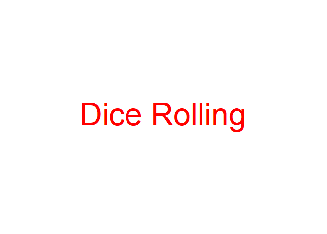
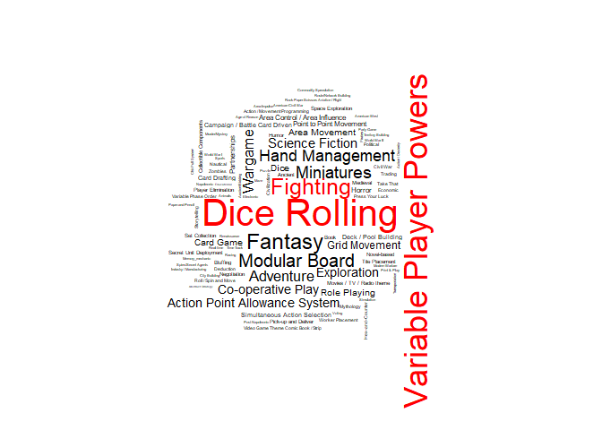

Board Game
================
Jui-Ying Hsieh, Li-Hsin Chen

### 1. Background

We enjoy playing baord games. We have collected more than 20 types of board games, and the number is still growing. We like to explore games, but play one new games after another blindly is not smart. There are evidence shown that more and more games are being created; 1600 games released in the last five years, while only 1086 games released in the 19th century. To explore games efficiently, we frequently visit the famous board game website BoardGameGeek (BGG). There is a comprehensive list of games including their rankings. Our approach to explore games is to review their rankings. We did actually find enjoyable games such as Agricola, Peurto Rico and Pandemic.

However, as we collect more and more games, we find out that rankings does not making us to find enjoyable games. It is obvious that most of the top ranking games are strategy games. Other types of games typically are not able to go to top ranking because BGG's users prefer "heavier" games. For example, one of our favorite board games "cat in the sack" is ranked 1077 in BGG, but we really enjoy playing this "light" game. So we think this game, and very likely other "light" games, are way underestimated.

Hence, we grabbed the data from BGG, and tried to build a "fair" board game reference system that help players find their favorite games. This project is about designing a board game reference system, Board Game Match, that finds the most enjoyable games for users. We hope Board Game Match can save players time and effort to explore new games.

### 2. Method

Several fantastic algorithms have been invented and used for recommendation systems in the past few years. The choice of algorithms highly depends on the data used for the system. Since the data we have contains only information of boardgame, we choose [item-based collaborative filtering](https://en.wikipedia.org/wiki/Item-item_collaborative_filtering) method. In this method, recommendation is made by the similarity of items among each others, that is, how similar they are according to their features.

This project is done in R with the following packages:

``` r
library(tidyverse)
library(ggplot2)
library(wordcloud2)
library(wordcloud)
boardgame <- read_csv("~/bgg_db_2018_01.csv")
```

Dataset is obtained from [Kaggle](https://www.kaggle.com/mrpantherson/board-game-data#bgg_db_2018_01.csv). This dataset contains many interesting features of about 5,000 boardgames. These features include:

``` r
colnames(boardgame)
```

    ##  [1] "rank"        "bgg_url"     "game_id"     "names"       "min_players"
    ##  [6] "max_players" "avg_time"    "min_time"    "max_time"    "year"       
    ## [11] "avg_rating"  "geek_rating" "num_votes"   "image_url"   "age"        
    ## [16] "mechanic"    "owned"       "category"    "designer"    "weight"

In this section, we will go through the process of building a recommendation system for boardgames. Data preprocessing will be conducted in sector 2.1. To reduce the calculation of pair-wise similarities, clustering will be applied on the processed data in section 2.2. Similarity between boardgames defined in sector 2.3 will be calculated only within the same cluster. Finally, we can make recommendations for boardgames in sector 2.4 based on the similarity we defined.

#### 2.1 Data Processing

We delete the duplicated board games and remove the missing values.

```{r}
boardgame = boardgame[!duplicated(boardgame$names),]
boardgame <- na.omit(boardgame)
```

Instead of considering all features of boardgames, we use only "mechanic" and "category" in our system. There are 52 different mechanic types and 84 different categories. Hence, 136 (52 + 84) dummy variables are created to represent mechanic and category variables.

``` r
# All_mechanic = unlist(strsplit(boardgame$mechanic, ", "))
# Uniq_mechanic = unique(All_mechanic)
# All_cat = unlist(strsplit(boardgame$category, ", "))
# Uniq_cat = unique(All_cat)
# 
# boardgame_cluster <- matrix(0,nrow = dim(boardgame)[1],ncol = length(Uniq_mechanic)+length(Uniq_cat))
# 
# for(i in 1:length(Uniq_mechanic)){
#   boardgame_cluster[,i] <- grepl(Uniq_mechanic[i],boardgame$mechanic)*1
# }
# for(i in 1:length(Uniq_cat)){
#   boardgame_cluster[,length(Uniq_mechanic)+i] <- grepl(Uniq_cat[i],boardgame$category)*1
# }
# boardgame_cluster <- as.data.frame(boardgame_cluster)
# colnames(boardgame_cluster)[1:length(Uniq_mechanic)] <- Uniq_mechanic
# colnames(boardgame_cluster)[(1+length(Uniq_mechanic)):136] <- Uniq_cat

mechanic_df = as.data.frame(sapply(Uniq_mechanic, function(x) grepl(x, boardgame$mechanic)*1))
category_df = as.data.frame(sapply(Uniq_category, function(x) grepl(x, boardgame$category)*1))
boardgame_cluster = cbind(boardgame, mechanic_df, category_df)

# what is this?
colnames(boardgame_cluster)[50] <- "none_mechanic"
colnames(boardgame_cluster)[114] <- "none_cat"
colnames(boardgame_cluster)[26] <- "Memory_mechanic"
colnames(boardgame_cluster)[117] <- "Memory_cat"
```

Remove this?
``` r
colnames(boardgame_cluster)[1:20]
```

    ##  [1] "Action / Movement Programming" "Co-operative Play"            
    ##  [3] "Grid Movement"                 "Hand Management"              
    ##  [5] "Modular Board"                 "Role Playing"                 
    ##  [7] "Simultaneous Action Selection" "Storytelling"                 
    ##  [9] "Variable Player Powers"        "Action Point Allowance System"
    ## [11] "Point to Point Movement"       "Set Collection"               
    ## [13] "Trading"                       "Auction/Bidding"              
    ## [15] "Card Drafting"                 "Area Control / Area Influence"
    ## [17] "Campaign / Battle Card Driven" "Dice Rolling"                 
    ## [19] "Tile Placement"                "Area Movement"

#### 2.2 Clustering

Since there are about 5,000 boardgames in the dataset, it will be computationally expensive to calculate simliarities for all possible pair-wise combinations. Hence, we first cluster the boardgames into few groups, and then calculated similarities for boardgames within the same group.

[K-means](https://en.wikipedia.org/wiki/K-means_clustering) is one of the most popular and intuitive clustering method. This method aims at finding k clusters such that the within-cluster sum of squares is minimized. The result of k-means is affected by the initialization of k points. Hence, k-means is performed several times (default 100 times) and the cluster with max count is assigned to each boardgames. Here, we use *k* = 5 as an example:

``` r
#=========================================================
# Clustering (K-means) determined by max mode
#=========================================================
n_cluster <- 5
getmode <- function(v) {
  uniqv <- unique(v)
  uniqv[which.max(tabulate(match(v, uniqv)))]
}

cluster_max <- function(dat,n_cluster,num_iter){
  result <- matrix(0,nrow = dim(dat)[1],ncol = num_iter)
  for(i in 1:num_iter){
    result[,i] <- kmeans(dat,centers = n_cluster)$cluster
  }
  return(apply(result,MARGIN = 1,getmode))
}
#========================================================
#========================================================
cluster_result <- cluster_max(boardgame_cluster,n_cluster = n_cluster,num_iter = 100)
```

Principal component analysis (PCA) is performed to visualize the result of clustering.

``` r
#========================================================
# Visualize clusters
#========================================================
# Visualize through PCA
library(MASS)
library(FactoMineR)
bgg_pca <- PCA(scale(boardgame_cluster),ncp = 6,graph = FALSE)

plot(bgg_pca,axes = c(1,2),habillage = "ind",col.hab = cluster_result,label = "none")
legend(10,10,1:n_cluster,col = 1:n_cluster,pch = 1,pt.lwd = 4)
```


``` r
boardgame_cluster_all <- cbind(names = boardgame$names,boardgame_cluster,cluster = cluster_result)
boardgame_cluster_all %>% group_by(cluster) %>% summarise(n=n())
```

    ## # A tibble: 5 x 2
    ##   cluster     n
    ##     <dbl> <int>
    ## 1       1  3220
    ## 2       2   395
    ## 3       3   285
    ## 4       4   348
    ## 5       5   751

#### 2.3 Similarity

#### 2.4 Recommendation System


### 3. Result

``` r
#=========================================================
# Word Cloud and Frequency Plot
#=========================================================
word_freq <- c()
for(i in 1:n_cluster){
  word_freq <- cbind(word_freq,apply(boardgame_cluster_all[boardgame_cluster_all$cluster==i,-c(1,138)],2,sum))
}
```

``` r
i = 5
d <- data.frame(word=names(sort(word_freq[,i],decreasing = T)),freq = sort(word_freq[,i],decreasing = T))
color = c(2,2,2,rep(1,length(d$word)-3))

size = 4
t = 0
while(is.null(t)!=T){
  t <- tryCatch(expr = {wordcloud(words = d$word,freq = d$freq,max.words = 100, scale = c(size,0.2),random.order = F,ordered.colors = T,colors = color,rot.per = 0.1)}, 
                warning = function(w) w
  )
  size = size*.8
}
```



``` r
ggplot(data = d[1:10,],aes(x = reorder(word,-freq),y = freq)) + 
  geom_bar(stat = "identity", fill = "steelblue") +
  xlab("Game Type")+ ylab("Frequency") +
  ggtitle(paste("Top 10 Game Types of Cluster ",i))+
  theme_classic() +
  theme(
    axis.text.x = element_text(angle = 45, hjust = 1),
    plot.title = element_text(size=24, face="bold.italic",hjust = 0.5),
    axis.title.x = element_text(size=14, face="bold"),
    axis.title.y = element_text(size=14, face="bold")
  )
```


### 4. Future Work

\*\* Combine current data with customer's data \*\* make better prediction
